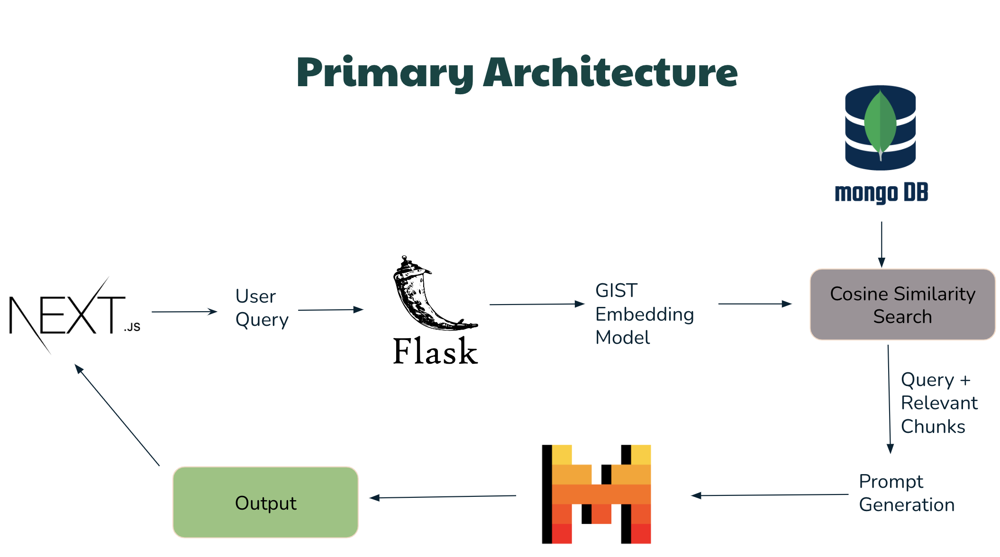
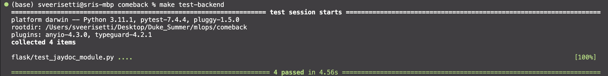
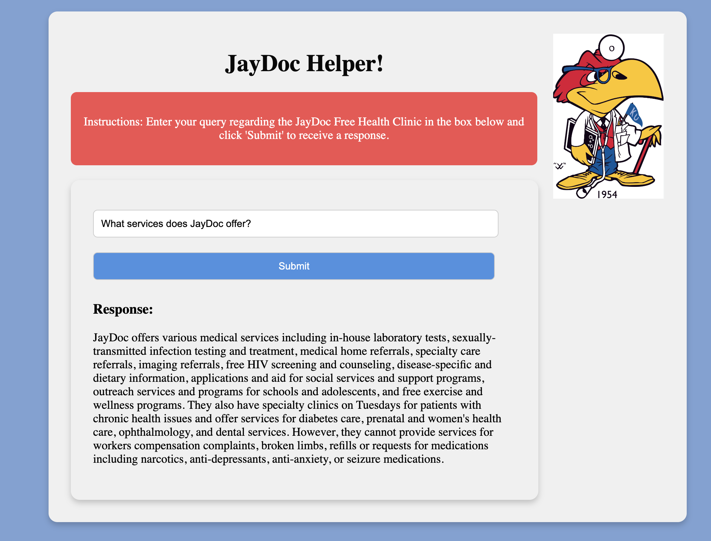
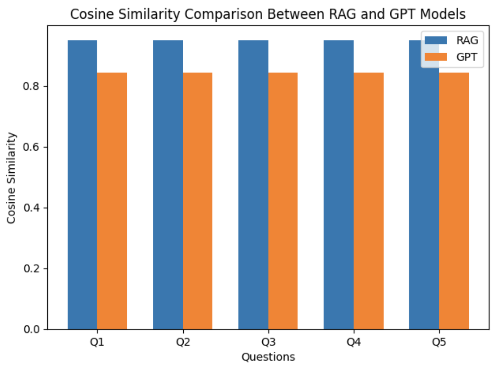

# AIPI 561 Project: JayDoc Free Health Clinic Helper

Objective: The purpose of this project is to leverage the capabilities of the meta-llama/Llama-2-7b-instruct Large Language Model llamafile to develop an interactive application. This application enables users to ask questions and receive detailed information about the JayDoc Free Health Clinic located in Kansas City. The JayDoc Free Health Clinic is an important community resource that provides free healthcare services to the underserved populations of Kansas City. The clinic is staffed by medical students under the supervision of licensed physicians and offers a wide variety of services including general health consultations, preventative care, and specialized services such as diabetes management and women's health.

## Primary Architecture

The primary architecture of the application involves several key components and processes:

1. **User Query Submission:**
   - The user submits their query via a Next.js front-end interface.

2. **Flask Application:**
   - The query is received by a Flask application, which serves as the backend.
   - Flask processes the query and passes it to the embedding model for further processing.

3. **GIST Embedding Model:**
   - The user's query is embedded using the GIST Embedding Model, which converts the textual query into a numerical representation.

4. **MongoDB and Cosine Similarity Search:**
   - The embedded query is sent to MongoDB, where it is compared against stored embeddings using a Cosine Similarity Search.
   - Relevant chunks of information are retrieved based on their similarity to the user's query.

5. **Prompt Generation:**
   - The retrieved relevant chunks are combined with the original query to generate a comprehensive prompt.
   - This prompt is designed to provide context and enhance the response quality.

6. **Mistral Model:**
   - The generated prompt is processed by the Mistral model, which generates a detailed and contextually appropriate response.

7. **Output:**
   - The response generated by the Mistral model is returned to the user via the Next.js front-end interface.

## Instructions for Setup, Running, and Testing the Application

### Prerequisites

Before you begin, ensure you have the following installed on your machine:
- Docker (for containerization)
- Docker Compose (to manage multi-container Docker applications)
- Make (to run the provided Makefile commands)

### Setup

1. Clone the repository and navigate to the root directory of the project.
2. Ensure Docker and Docker Compose are installed and running on your machine.

### Running the Application

1. Use the provided Makefile to build and run the backend and frontend services as Docker containers. This process utilizes the Dockerfiles provided in the `flask` and `nextjs` directories.
2. The Makefile will execute the following steps:
   - Install dependencies for both the backend and frontend.
   - Format and lint the backend code.
   - Run tests for the backend.
   - Build Docker images for both the backend and frontend.
   - Start the services using `docker-compose`.

### Access the Application

1. Once the services are running:
   - The backend Flask service will be accessible at `http://localhost:5000`.
   - The frontend Next.js service will be accessible at `http://localhost:3000`.

### Testing the Application

1. For backend testing:
   - The tests are located in the tests directory and use `pytest`.
   - Run tests using the Makefile using `test-backend` to verify backend functionality.
  

### Example Usage

1. Access the application by navigating to the frontend URL in your web browser.
2. Enter a query related to the JayDoc Free Health Clinic, such as "What services does JayDoc offer?" in the search bar on the homepage.
3. View the response, which will display the relevant information retrieved from the database.

## Performance & Evaluation Part 1: Speed 

### Average Response Time

The performance of the chatbot was evaluated based on the time it took to generate responses to various questions. Below are the results for some sample questions:

| Question                                                                | Text Generation Time (seconds) |
|-------------------------------------------------------------------------|-------------------------------:|
| What is JayDoc?                                                         |                         643.24 |
| What are the different specialty nights at JayDoc?                      |                         701.29 |
| Can I get teeth cleaning at JayDoc?                                     |                         406.44 |
| Do I need insurance for my health visit at JayDoc?                      |                         189.95 |
| Can you tell me more about the audiology and diabetes nights at JayDoc? |                         683.02 |

### Analysis

It can be concluded that the text generation time for the chatbot's responses varied depending on the type of question asked. For example:

- **Short, Simple Questions:** What I found was that questions that require straightforward, brief answers, such as "Do I need insurance for my health visit at JayDoc?" have shorter response times. This is because there is less information to process and relay to the user.

- **Detailed, Informative Questions:** Questions that typically require more comprehensive answers, such as "What are the different specialty nights at JayDoc?" tend to have longer response times. These questions require the language model to retrieve more detailed information chunks, which can result in longer text generation times.

### Average Text Generation Time

Here is the average text generation time across these examples: 

Average Time = (643.24 + 701.29 + 406.44 + 189.95 + 683.02) / 5 = 524.788 seconds

The average text generation time for the evaluated questions is approximately **524.788 seconds**.

## Performance & Evaluation Part 2: Accuracy

### Analysis

For the same 5 questions, I measured the cosine similarity between the expected answers and the response from both my RAG system and the standard GPT-4o model. Higher cosine similarity values will indicate more accurate responses in this case. It can be concluded, based on the graph below, that the Mistral model with the addition of RAG outperformed the standard GPT-4o model across all 5 questions. Logically, this makes sense because the standard GPT-4o model is not trained comprehensively on JayDoc. Mistral has access to the vectorized database containing comprehensive information regarding JayDoc, which is why it performed better. 

### Cosine Graph Visualization

The graph below shows the cosine similarities between each model's response with the actual answers of the questions:

